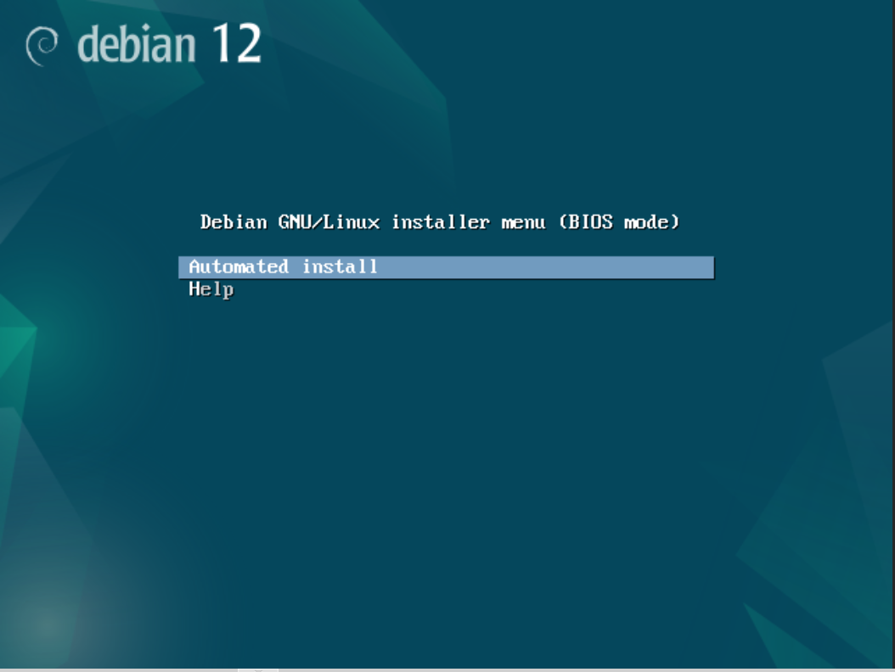
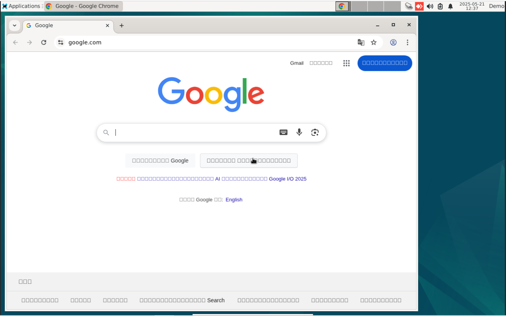

# yc-project-1
This project is to create an ISO image for automated install Debian 12.x on a PC (or VM).

## How to use
The script should work on debian based system, it has been tested on Debian-12, but any recent Debian/Ubuntu
should be fine.

Clone this project into a directory, for example

```sh
git clone https://github.com/ChatchaiJ/yc-project-1.git
cd yc-project-1
```

and then

```sh
sh rebuild-iso.sh
```

It should create an ISO image file called `/tmp/auto-install.iso`. It size should be about 8xx MB.
This file could be used to write to a USB drive using tools such as 'rufus' or 'dd' on Linux.

```sh
dd if=/tmp/auto-install.iso of=/dev/sdX status=progress
```

The '/dev/sdX' above should be the device name of the USB drive.
You might need "sudo" to run above command, if you are not already be root.

Then the USB drive could be used as boot device for the PC for automated install.
After boot, it should show up like this



After press enter, the installation process should started without need for user input until it finished.
After that the PC should reboot automatically. The USB drive or CDROM image (in case of VM) could be detached
from PC or VM, and the machine then should be reboot to a Debian-12 PC with XFCE desktop.

This PC/VM also will autologin to user 'demo' automatically.
Apart of basic Debian packages for XFCE Desktop installed, there are also two external packages

 - Google Chrome
 - Anydesk

installed. Also the google-chrome should started automatically.



Note: The current version of config still need user to login once

```
login: demo
password: X1234
```

and accept the setup of chrome once. 
After that the next reboot of this machine will give full autologin and open google-chrom automatically.
